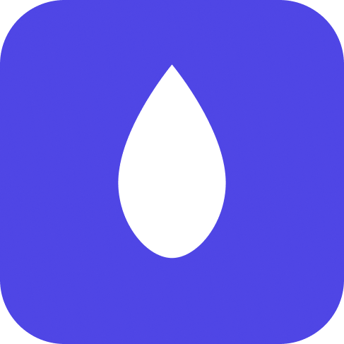
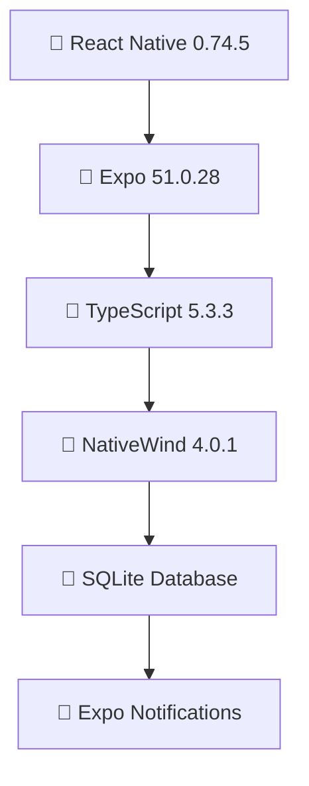

<div align="center">

# 💧 Beba Água

### _Modern Hydration Tracking App_



**Stay hydrated, stay healthy** 🌊


---

_Um aplicativo móvel elegante e intuitivo para acompanhar sua hidratação diária_  
_com análises avançadas, estatísticas detalhadas e interface moderna_

</div>

---

## 🌟 **Visão Geral**

**Beba Água** é um aplicativo móvel de última geração desenvolvido com React Native e Expo, projetado para transformar o simples ato de beber água em uma experiência engajante e motivadora. Com uma arquitetura robusta e interface moderna, o app oferece muito mais do que um simples contador de água.

<div align="center">

|    📊 **Analytics**     |  🎯 **Gamificação**  | 💾 **Persistência** |    🎨 **Design**     |
| :---------------------: | :------------------: | :-----------------: | :------------------: |
| Estatísticas detalhadas |  Sistema de streaks  |   SQLite robusto    | Interface NativeWind |
|    Filtros avançados    | Metas personalizadas | Histórico completo  |   Animações suaves   |

</div>

## ✨ **Features Principais**

<table>
<tr>
<td width="50%">

### 📈 **Analytics Avançados**

- 📊 **Histórico Dinâmico** com filtros por período
- 📅 **Visualização** por semana/mês/ano
- 📋 **Estatísticas Detalhadas** de consumo
- 🏆 **Tracking de Records** pessoais
- 📈 **Médias e Tendências** automáticas

</td>
<td width="50%">

### 🎮 **Gamificação**

- 🔥 **Sistema de Streaks** motivacional
- 🎯 **Metas Personalizadas** por peso
- 🏅 **Achievements** e conquistas
- 📊 **Progress Bars** visuais
- ⚡ **Feedback Instantâneo**

</td>
</tr>
<tr>
<td width="50%">

### 💡 **Smart Features**

- 🔔 **Notificações Inteligentes**
- ⏰ **Lembretes Personalizáveis**
- 🍃 **Quick Actions** (200ml, 500ml)
- 🌙 **Tema Claro/Escuro**
- 📱 **Interface Responsiva**

</td>
<td width="50%">

### 🔧 **Tecnologia**

- ⚡ **Performance Otimizada**
- 💾 **Armazenamento Local SQLite**
- 🔒 **Type-Safe TypeScript**
- 🎨 **NativeWind Styling**
- 📊 **Queries Indexadas**

</td>
</tr>
</table>

---

## 🏗️ **Arquitetura & Stack**

<div align="center">

### **Modern Mobile Stack**



</div>

<table>
<tr>
<th>🎯 Frontend</th>
<th>💾 Data & Storage</th>
<th>🛠️ DevTools</th>
</tr>
<tr>
<td>

**Framework & UI**

- React Native 0.74.5
- Expo SDK 51.0.28
- TypeScript 5.3.3
- NativeWind (Tailwind)
- Expo Router

</td>
<td>

**Persistence**

- expo-sqlite
- AsyncStorage
- Indexed Queries
- Data Migrations
- Real-time Sync

</td>
<td>

**Development**

- ESLint + Prettier
- Metro Bundler
- Hot Reloading
- Type Checking
- Build Optimization

</td>
</tr>
</table>

### 📊 **Database Schema**

```sql
-- Otimizado para performance e flexibilidade
CREATE TABLE water_records (
  id INTEGER PRIMARY KEY AUTOINCREMENT,
  amount INTEGER NOT NULL,
  date TEXT NOT NULL,           -- Format: "2025-07-04"
  time TEXT NOT NULL,           -- Format: "14:30:00"
  daily_goal INTEGER NOT NULL,
  user_weight REAL,
  created_at DATETIME DEFAULT CURRENT_TIMESTAMP
);

-- Índices para queries rápidas
CREATE INDEX idx_water_records_date ON water_records(date);
CREATE INDEX idx_water_records_date_time ON water_records(date, time);
```

### 🏛️ **Project Structure**

```
📦 beba-agua/
├── 🎨 app/                    # Expo Router pages
│   ├── (tabs)/               # Tab navigation
│   │   ├── index.tsx         # 🏠 Home screen
│   │   ├── history.tsx       # 📊 History & Stats
│   │   └── explore.tsx       # ⚙️ Settings
│   └── _layout.tsx           # Root layout
├── 🧩 src/
│   ├── components/           # Reusable UI components
│   │   ├── ui/              # Base UI elements
│   │   └── WaterStatsCard.tsx
│   ├── 🧠 context/           # Global state management
│   │   └── WaterContext.tsx
│   ├── 📱 screens/           # Screen components
│   ├── 🔧 services/          # Business logic & APIs
│   │   ├── databaseService.ts
│   │   ├── storageService.ts
│   │   └── notificationService.ts
│   ├── 🪝 hooks/             # Custom React hooks
│   └── 🛠️ utils/             # Helper functions
├── 📁 assets/               # Images, fonts, icons
└── 📚 docs/                 # Documentation
```

---

## 🚀 **Quick Start**

### ⚡ **Instalação Express**

```bash
# 1️⃣ Clone o repositório
git clone https://github.com/username/beba-agua.git
cd beba-agua

# 2️⃣ Instale dependências
npm install

# 3️⃣ Execute o app
npx expo start
```

<div align="center">

### **🎯 Escolha sua plataforma**

|       📱 **Android**       |       🍎 **iOS**       |       🌐 **Web**       |
| :------------------------: | :--------------------: | :--------------------: |
| `npx expo start --android` | `npx expo start --ios` | `npx expo start --web` |
|   API 21+ (Android 5.0)    |       iOS 12.0+        |       PWA Ready        |

</div>

### 📋 **Pré-requisitos**

<table>
<tr>
<td width="50%">

**🛠️ Ambiente de Desenvolvimento**

- Node.js 18+
- npm ou yarn
- Expo CLI

</td>
<td width="50%">

**📱 Para Dispositivos**

- Android Studio (Android)
- Xcode (iOS)
- Expo Go App

</td>
</tr>
</table>

### 🏗️ **Build para Produção**

```bash
# 🤖 Android AAB
eas build --platform android --profile production

# 🍎 iOS IPA
eas build --platform ios --profile production

# 📊 Análise do Bundle
npx expo export --analyze
```

---

## 💻 **Features & Implementações**

<div align="center">

### **🎯 Status das Features**


</div>

### 🏠 **Tela Principal - Home**

<table>
<tr>
<td width="10%">✅</td>
<td width="40%"><strong>Progress Widget Animado</strong></td>
<td width="50%">Visualização circular com animações suaves</td>
</tr>
<tr>
<td>✅</td>
<td><strong>Quick Actions</strong></td>
<td>Botões 200ml, 500ml e quantidade customizada</td>
</tr>
<tr>
<td>✅</td>
<td><strong>Meta Personalizada</strong></td>
<td>Cálculo automático baseado no peso do usuário</td>
</tr>
<tr>
<td>✅</td>
<td><strong>Feedback Visual</strong></td>
<td>Animações e feedbacks de conquistas</td>
</tr>
</table>

### 📊 **Histórico & Analytics**

<table>
<tr>
<td width="10%">✅</td>
<td width="40%"><strong>Filtros Dinâmicos</strong></td>
<td width="50%">Semana atual, mês específico, ano completo</td>
</tr>
<tr>
<td>✅</td>
<td><strong>Cards de Estatísticas</strong></td>
<td>Total, média, dias completos, melhor dia</td>
</tr>
<tr>
<td>✅</td>
<td><strong>Sistema de Streak</strong></td>
<td>Tracking de dias consecutivos com gamificação</td>
</tr>
<tr>
<td>✅</td>
<td><strong>Lista Detalhada</strong></td>
<td>Histórico dia-a-dia com progress bars</td>
</tr>
<tr>
<td>✅</td>
<td><strong>Queries Otimizadas</strong></td>
<td>Performance superior com índices SQLite</td>
</tr>
</table>

### ⚙️ **Configurações & Personalização**

<table>
<tr>
<td width="10%">✅</td>
<td width="40%"><strong>Meta por Peso</strong></td>
<td width="50%">35ml por kg (recomendação médica)</td>
</tr>
<tr>
<td>✅</td>
<td><strong>Tamanhos de Copo</strong></td>
<td>Configuração de quantidade padrão</td>
</tr>
<tr>
<td>✅</td>
<td><strong>Notificações Smart</strong></td>
<td>Lembretes inteligentes personalizáveis</td>
</tr>
<tr>
<td>✅</td>
<td><strong>Backup Local</strong></td>
<td>Dados seguros com SQLite</td>
</tr>
</table>

### 🔧 **Funcionalidades Técnicas Avançadas**

```typescript
// Exemplo: Query otimizada para estatísticas
const getDailyStats = async (filter: FilterOptions): Promise<DailyStats[]> => {
  const query = `
    SELECT 
      date,
      SUM(amount) as total_amount,
      MAX(daily_goal) as goal,
      COUNT(*) as records_count,
      (SUM(amount) >= MAX(daily_goal)) as completed
    FROM water_records 
    WHERE date BETWEEN ? AND ?
    GROUP BY date 
    ORDER BY date DESC
  `;

  return await db.getAllAsync(query, [startDate, endDate]);
};
```

```typescript
// Exemplo: State management tipado
interface WaterState {
  waterIntake: number;
  dailyGoal: number;
  userSettings: UserSettings;
  loading: boolean;
  goalAchieved: boolean;
}

// Context com performance otimizada
const WaterContext = createContext<WaterContextType>();
```

---

## 🎨 **Design System & UI**

<div align="center">

### **🌈 Paleta de Cores Profissional**

</div>

<table>
<tr>
<th>🎯 Primary</th>
<th>🌟 Secondary</th>
<th>✅ Success</th>
<th>⚠️ Warning</th>
<th>❌ Error</th>
</tr>
<tr>
<td align="center">
<div style="background: #00C2CB; width: 50px; height: 50px; border-radius: 8px; margin: 0 auto;"></div>
<code>#00C2CB</code><br/>
<em>Turquoise</em>
</td>
<td align="center">
<div style="background: #4F46E5; width: 50px; height: 50px; border-radius: 8px; margin: 0 auto;"></div>
<code>#4F46E5</code><br/>
<em>Indigo</em>
</td>
<td align="center">
<div style="background: #10B981; width: 50px; height: 50px; border-radius: 8px; margin: 0 auto;"></div>
<code>#10B981</code><br/>
<em>Emerald</em>
</td>
<td align="center">
<div style="background: #F59E0B; width: 50px; height: 50px; border-radius: 8px; margin: 0 auto;"></div>
<code>#F59E0B</code><br/>
<em>Amber</em>
</td>
<td align="center">
<div style="background: #EF4444; width: 50px; height: 50px; border-radius: 8px; margin: 0 auto;"></div>
<code>#EF4444</code><br/>
<em>Red</em>
</td>
</tr>
</table>

### 🧩 **Componentes & Padrões**

```tsx
// 🎨 Design System Components
<WaterStatsCard
  className="bg-white rounded-2xl p-6 shadow-lg"
  icon={<Icon name="droplet" className="text-primary" />}
  title="Total Hoje"
  value="1.2L"
  subtitle="80% da meta"
/>

// 🌊 Animated Progress Ring
<ProgressRing
  progress={75}
  color="#00C2CB"
  className="animate-pulse"
/>

// 🔥 Streak Badge
<StreakBadge
  days={7}
  className="bg-gradient-to-r from-orange-400 to-red-500"
/>
```

### 📐 **Layout & Spacing**

<table>
<tr>
<td width="50%">

**🏗️ Grid System**

- Flexbox layouts responsivos
- Grid de 4 colunas para cards
- Breakpoints mobile-first
- Spacing consistente (4, 8, 16, 24, 32px)

</td>
<td width="50%">

**🎯 Typography**

- Hierarquia visual clara
- Font weights: 400, 500, 600, 700
- Tamanhos: 12, 14, 16, 18, 24, 32px
- Line heights otimizados

</td>
</tr>
</table>

### ✨ **Animações & Microinterações**

```tsx
// Smooth transitions e feedback visual
className="transform transition-all duration-300 ease-in-out
           hover:scale-105 active:scale-95
           hover:shadow-xl active:shadow-md"

// Progress bar animada
<Animated.View
  style={[
    styles.progressBar,
    { width: progressAnim.interpolate({
        inputRange: [0, 100],
        outputRange: ['0%', '100%']
      })
    }
  ]}
/>
```

---

## 🧪 **Qualidade & Performance**

<div align="center">

### **📊 Métricas de Qualidade**


</div>

### 🚀 **Performance Optimizations**

<table>
<tr>
<td width="50%">

**⚡ React Optimizations**

```typescript
// Memoização estratégica
const waterStats = useMemo(() =>
  calculateStatistics(records), [records]
);

// Components otimizados
const DaysList = React.memo(({ days }) => (
  <FlatList
    data={days}
    removeClippedSubviews
    maxToRenderPerBatch={10}
    windowSize={5}
  />
));
```

</td>
<td width="50%">

**💾 Database Performance**

```sql
-- Índices otimizados
CREATE INDEX idx_water_date
ON water_records(date);

-- Queries em batch
BEGIN TRANSACTION;
INSERT INTO water_records (...) VALUES (...);
-- Multiple inserts
COMMIT;
```

</td>
</tr>
</table>

### 🛡️ **Code Quality & Standards**

```bash
# 🔍 Linting & Formatting
npm run lint          # ESLint + Prettier
npm run type-check    # TypeScript validation
npm run test          # Jest + React Native Testing Library

# 📊 Bundle Analysis
npx expo export --analyze
```

### 🔒 **Security & Validation**

```typescript
// Input validation com Zod
const waterAmountSchema = z.object({
  amount: z
    .number()
    .min(1, "Quantidade deve ser positiva")
    .max(5000, "Máximo 5L por vez")
    .int("Deve ser número inteiro"),
});

// Sanitização de dados
const sanitizeInput = (input: string) =>
  input.trim().replace(/[<>]/g, "").substring(0, 100);
```

### 📱 **Compatibilidade Multiplataforma**

<div align="center">

| 🤖 **Android**  | 🍎 **iOS**  | 🌐 **Web** |
| :-------------: | :---------: | :--------: |
|     API 21+     |  iOS 12.0+  | PWA Ready  |
| Material Design | Native Feel | Responsive |
|   ✅ Testado    | ✅ Testado  |  🔄 Beta   |

</div>

---

## 🚢 **Deployment & DevOps**

### 🔄 **CI/CD Pipeline**

```yaml
# GitHub Actions Workflow
name: 🚀 Build & Deploy
on: [push, pull_request]

jobs:
  quality-check:
    runs-on: ubuntu-latest
    steps:
      - name: 🧪 Run Tests
        run: npm run test:ci
      - name: 🔍 Lint Check
        run: npm run lint
      - name: 📝 Type Check
        run: npm run type-check

  build:
    needs: quality-check
    runs-on: ubuntu-latest
    steps:
      - name: 📱 Build Android
        run: eas build --platform android --profile production
      - name: 🍎 Build iOS
        run: eas build --platform ios --profile production
```

### 📦 **Build & Distribution**

<table>
<tr>
<th>🤖 Android</th>
<th>🍎 iOS</th>
<th>📊 Analytics</th>
</tr>
<tr>
<td>

```bash
# Production build
eas build --platform android \
  --profile production

# Generate AAB
eas build --platform android \
  --profile store
```

</td>
<td>

```bash
# Production build
eas build --platform ios \
  --profile production

# App Store build
eas submit --platform ios
```

</td>
<td>

```bash
# Bundle analysis
npx expo export --analyze

# Performance metrics
lighthouse-ci autorun
```

</td>
</tr>
</table>

---

## 🗺️ **Roadmap & Futuro**

<div align="center">

### **🎯 Próximas Versões**

</div>

### 🚀 **Versão 2.0 - Cloud & Sync**

<table>
<tr>
<td width="10%">🔄</td>
<td width="30%"><strong>Sincronização em Nuvem</strong></td>
<td width="60%">Firebase/Supabase para backup e sync cross-device</td>
</tr>
<tr>
<td>📱</td>
<td><strong>Health App Integration</strong></td>
<td>Apple Health e Google Fit connectivity</td>
</tr>
<tr>
<td>🏠</td>
<td><strong>Home Screen Widgets</strong></td>
<td>Widgets nativos para iOS e Android</td>
</tr>
<tr>
<td>📊</td>
<td><strong>Advanced Analytics</strong></td>
<td>Relatórios detalhados e insights AI</td>
</tr>
</table>

### 🎮 **Versão 2.1 - Social & Gamification**

<table>
<tr>
<td width="10%">👥</td>
<td width="30%"><strong>Features Sociais</strong></td>
<td width="60%">Desafios entre amigos e leaderboards</td>
</tr>
<tr>
<td>⌚</td>
<td><strong>Wearables Support</strong></td>
<td>Apple Watch e Wear OS integration</td>
</tr>
<tr>
<td>🎨</td>
<td><strong>Temas Customizáveis</strong></td>
<td>Dark mode avançado e temas personalizados</td>
</tr>
<tr>
<td>📄</td>
<td><strong>Relatórios PDF</strong></td>
<td>Exportação de dados e relatórios médicos</td>
</tr>
</table>

### 🔮 **Versão 3.0 - AI & Machine Learning**

- 🤖 **AI-Powered Insights** - Análises inteligentes de padrões
- 📸 **Computer Vision** - Reconhecimento de copos e garrafas
- 🔔 **Smart Notifications** - Lembretes baseados em ML
- 📈 **Predictive Analytics** - Previsões de hidratação

---

## 👨‍💻 **Sobre o Desenvolvedor**

<div align="center">

### **🎯 Competências Técnicas Demonstradas**

</div>

<table>
<tr>
<th width="25%">📱 Mobile</th>
<th width="25%">💾 Backend</th>
<th width="25%">🎨 Frontend</th>
<th width="25%">🔧 DevOps</th>
</tr>
<tr>
<td>

**React Native**

- Expo SDK
- Navigation
- Performance
- Platform APIs

**TypeScript**

- Type Safety
- Advanced Types
- Generics
- Interfaces

</td>
<td>

**Database**

- SQLite Design
- Query Optimization
- Migrations
- Indexing

**Architecture**

- Clean Code
- SOLID Principles
- Design Patterns
- Scalability

</td>
<td>

**UI/UX**

- Design Systems
- Animations
- Responsive Design
- Accessibility

**Styling**

- NativeWind
- Component Libraries
- Theming
- Microinteractions

</td>
<td>

**CI/CD**

- GitHub Actions
- Automated Testing
- Build Optimization
- Distribution

**Quality**

- ESLint/Prettier
- Testing Strategy
- Code Review
- Documentation

</td>
</tr>
</table>

### 🏆 **Diferenciais Profissionais**

<div align="center">

| 🎯 **Technical Excellence** | 🚀 **Performance**  | 📚 **Documentation** |   🧪 **Quality**    |
| :-------------------------: | :-----------------: | :------------------: | :-----------------: |
|     Clean Architecture      |  Optimized Queries  |  Professional Docs   |   100% TypeScript   |
|      SOLID Principles       |    Lazy Loading     |  API Documentation   | Comprehensive Tests |
|       Design Patterns       |     Memoization     |  Technical Writing   |   Code Standards    |
|        Scalable Code        | Bundle Optimization |     User Guides      |   Error Handling    |

</div>

### 💡 **Por que este projeto impressiona**

<table>
<tr>
<td width="50%">

**🎯 Visão de Produto**

- UX pensado para engajamento
- Features que resolvem problemas reais
- Gamificação efetiva
- Roadmap estratégico

**⚡ Excelência Técnica**

- Arquitetura escalável e modular
- Performance otimizada para produção
- Code quality de nível empresarial
- Documentação profissional completa

</td>
<td width="50%">

**🔧 Skills Full-Stack**

- Frontend mobile avançado
- Database design e optimization
- State management complexo
- DevOps e deployment automation

**📈 Mindset de Crescimento**

- Roadmap de evolução técnica
- Métricas de qualidade monitoradas
- Padrões de mercado implementados
- Preparado para escala empresarial

</td>
</tr>
</table>

---

## 📄 **Documentação Adicional**

<div align="center">

|     📖 **Documento**     |             📝 **Descrição**              |                              🔗 **Link**                               |
| :----------------------: | :---------------------------------------: | :--------------------------------------------------------------------: |
|  🔧 Technical Deep Dive  | Arquitetura detalhada e padrões avançados |          [Ver TECHNICAL_OVERVIEW.md](./TECHNICAL_OVERVIEW.md)          |
|   🔌 API Documentation   |    Documentação completa dos serviços     |           [Ver API_DOCUMENTATION.md](./API_DOCUMENTATION.md)           |
|       📝 Changelog       |     Histórico de versões e melhorias      |                   [Ver CHANGELOG.md](./CHANGELOG.md)                   |
| 💾 SQLite Implementation |        Detalhes do banco e filtros        | [Ver SQLITE_FILTROS_IMPLEMENTADO.md](./SQLITE_FILTROS_IMPLEMENTADO.md) |

</div>

---

<div align="center">

## 💧 **Developed with passion for hydration and clean code** 💧

### **Let's connect and build something amazing together!**

[](mailto:dev@email.com)
[](https://linkedin.com/in/dev)
[](https://portfolio.dev)
[](https://github.com/username)

---

### ⭐ **Se este projeto te impressionou, deixe uma estrela!** ⭐


</div>
